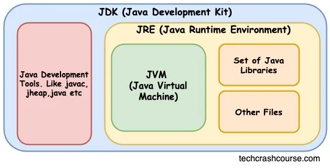
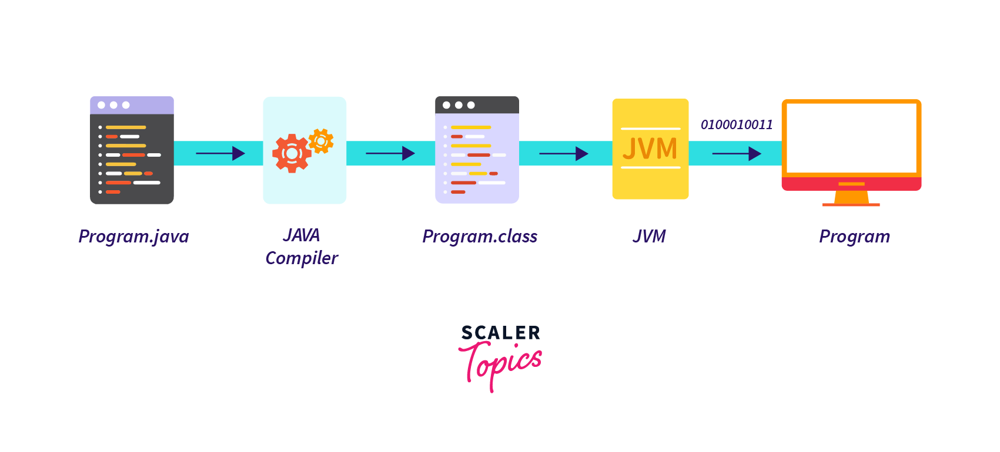

## 코드를 실행하기 위한 세 가지 키 컴포넌트, `JDK` vs `JRE` vs `JVM`

### 1. `JVM`

`JVM`은 자바를 platform-independent하게 만드는 핵심이며, Java 코드에 존재하는 `main` 메소드를 실행하는 실체이다.

먼저 .java 소스 파일은 `javac compiler`를 통해서 .class 파일로 컴파일된다.

`JVM`은 bytecode인 .class 파일을 컴퓨터가 실행할 수 있는 machine language로 변환한다.

.class 파일은 `JVM`의 Sub System인 `class loader`에 의해서 다음과 같은 과정을 거치게된다.

1. .class 파일을 메모리에 적재한다.
2. 바이트 코드의 보안을 검사한다.
3. 바이트 코드를 실행한다.

이외에도 메모리 관리, 가비지 컬렉션, 에러 리포팅 기능을 제공한다.

### 2. `JRE`

JVM을 구현한 것이 JRE다. JVM의 superset이며 JDK의 subset이다.

JVM과 자바를 실행하는데 있어서 필요한 라이브러리들을 결합한 것이다.

핵심 라이브러리들이란, Java Standard Edition (SE)와 같이 미리 만들어진 사용 가능한 컴포넌트들을 제공하는 라이브러리이다.

또한 `Java Archives`라는 자바 애플리케이션 배포를 간단하게 만들어주는 파일들도 포함된다.

### + bytecode는 machine code와 다른점

- bytecode는 가상 머신에 의해서 실행되며, machine code는 CPU에 의해서 실행된다.
- bytecode는 binary code, hexadecimal code, macro instruction 등으로 구성되어 가상 머신이 효율적으로 실행할 수 있도록 디자인됐지만, machine code는 binary code로만 구성되어 CPU가 실행 가능하다.
- source code와 machine code 사이의 intermediate code이다. 실행을 위해서는 interpreter를 거쳐야한다.
- bytecode는 platform independent하며 virtual machine에 dependent하다. virtual machine은 platform에 independent하다.
- bytecode는 intermediate-level code이며, machine code는 low-level code이다.

  [Difference between Byte Code and Machine Code | GeeksforGeeks](https://www.geeksforgeeks.org/difference-between-byte-code-and-machine-code/)

### `JDK`

`javac compiler`, `debugger`, `javadoc`, `jre`를 포함한다. `javadoc`은 소스코드 내 코멘트를 문서화하는데 사용되며, `debugger`는 런타임에 코드를 검사하여 트러블슈팅하는데 사용된다.

## `jar` vs `war`

`jar`(Java Archive)파일이란 .jar 익스텐션명을 가지며 `Java code(*.class)`와 `jar` 자체에 대한 메타데이터를 포함하는 ZIP 파일이다.종종 `Java sourcecode(*.java)`를 포함하기도 한다. ZIP 파일이므로 알집과 같은 파일로 압축 해제가 가능하다.

`war`(Web Application Archive)파일이란 .war 익스텐션명을 가지며 `Servlet`이나 `JSP 컨테이너`에 배포하기 위한 웹 기반 자바 애플리케이션을 패키징하기 위해 사용된다. `war`는 Java servlet, JSP 혹은 다른 웹 관련 리소스들(HTML,CSS,JS)를 압축하여 웹 서버에 배포한다.

`jar`는 자바 프로그램이나 라이브러리 배포, 재사용 가능한 코드를 패키징하기 위해 사용되며, `war`는 웹 애플리케이션을 웹 서버에 배포하기 위해 사용된다.

`jar` 파일은 `JRE`가 manifest 파일을 읽어 실행할 첫 클래스를 실행하며, `war` 파일은 웹 어플리케이션 구동을 위한 모든 파일이 포함돼있다.

## DEBTS

- Java Standard Edition이란?
- class loader의 구체적인 동작은?

## References

- [java - What exactly does a jar file contain? - Stack Overflow](https://stackoverflow.com/questions/12079230/what-exactly-does-a-jar-file-contain)

- [.class vs .java - Stack Overflow](https://stackoverflow.com/questions/1015340/class-vs-java)

- [How JVM Works – JVM Architecture | GeeksforGeeks](https://www.geeksforgeeks.org/jvm-works-jvm-architecture/)

- [How Java Program Works? - Scaler Topics](https://www.scaler.com/topics/java/how-java-program-works/)

- [JDK JRE and JVM](https://www.techcrashcourse.com/2017/02/difference-between-jdk-jre-and-jvm.html)

- [Differences Between JAR and WAR Packaging | Baeldung](https://www.baeldung.com/java-jar-war-packaging)

- [Difference Between JAR and WAR. Java Archive(Jar) File vs Web… | by Abdul Kadar | Medium](https://akadar899.medium.com/difference-between-jar-and-war-f39b4a430a25)
