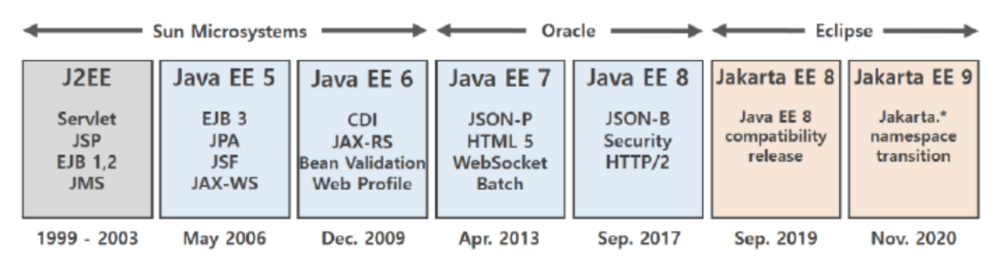
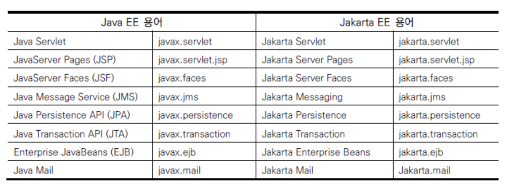

## JAVA EE vs Jakarta EE

JAVA EE는 상업용 표준 플랫폼인데, 오픈소스 SW의 발전과 릴리즈 주기가 길어지면서 인기가 시들었다.

오라클은 이클립스 재단에 JAVA EE 프로젝트를 이관했다. 이관이 되면서 Jakarta EE로 이름이 변경됐다.

JAVA EE는 계속 유지되지만 8 버전을 마지막으로 더 이상의 릴리즈와 추가 기능은 제공되지 않고 있다.

이름은 Java 2 Enterprise Edition(J2EE), Java EE, Jakarta EE(혹은 Eclipse Enterprise For Java, EE4J) 순으로 변경돼왔다.

자바 상표권은 오라클이 여전히 가지고 있다.

[Java SE vs Java EE | GeeksforGeeks](https://www.geeksforgeeks.org/java-se-vs-java-ee/)

[에스코어 | Java EE에서 Jakarta EE로의 전환](https://s-core.co.kr/insight/view/java-ee%EC%97%90%EC%84%9C-jakarta-ee%EB%A1%9C%EC%9D%98-%EC%A0%84%ED%99%98/)

[Java EE vs Java SE: Navigating the Landscape of Java Platforms | by Dávid Lakatos | Medium](https://medium.com/@lktsdvd/java-ee-vs-java-se-navigating-the-landscape-of-java-platforms-b6f8372362ba)
